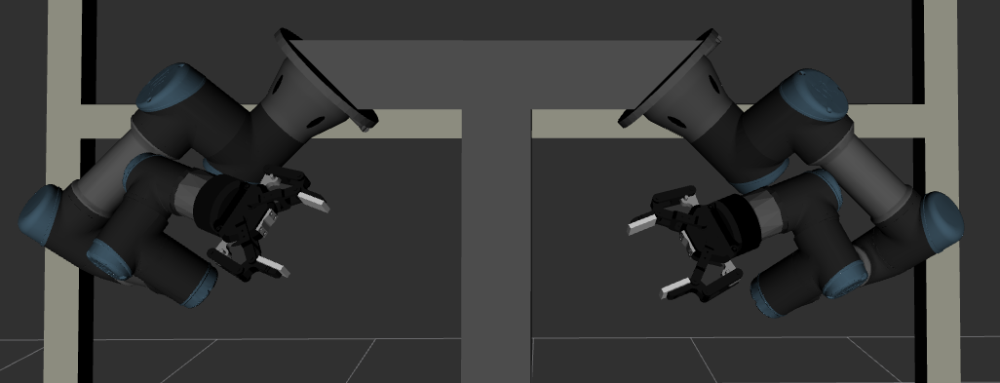

# dual-arm-workcell

I built this catkin workspace for simulating the dual-arm workcell I have been using for my robotic manipulation research. The workcell constitutes two UR3 robot arms equipped with 2F-85 robotiq grippers. The grippers have camera mounted on them manually. I carried out the intrinsic and extrinsic calibrations [here](https://github.com/Robotawi/hand-eye-calibration). The workcell has a cage with multiple cameras, mainly to provide visual and point cloud data.

## The simulated workcell/robot
The workcell simulation after building its xacro including workscell structure, robots, and grippers.

Here is a closed look on the dual-arm robot

## Purpose
This project is for porting my research studies to be done using ROS and MoveIt. It will also serve as my virtual lab for single arm and dual-arm manipulation planning. 

## Plan
I am planning to do the following with this workcell (short-term)

1. Add gripper camera as well as camera to provide PCL data.
2. Reproduce [the constrained motion planning work](https://github.com/Robotawi/constrained_motion_planning).
3. Reproduce graph-based motion planning work.

## Acknowledgement
My knowledge to build such systems has been accumulated while working closely with my PhD direct supervisor and friend [Dr. Weiwei Wan](https://wanweiwei07.github.io/). It has been a very interesting journey full of exploration, hard work, inspiration, and mutual love for robotic manipulation.

## Contact
In this project, I built everything from scratch because I love to understand how the internals of ROS work. This is a step towards my aim to actively contribute to robotics open-source software.

If you are interested in the presented work/ideas or if you have any questions, please feel free to connect with me on [LinkedIn](https://www.linkedin.com/in/mohraess). We can discuss about this project and other interesting projects.

