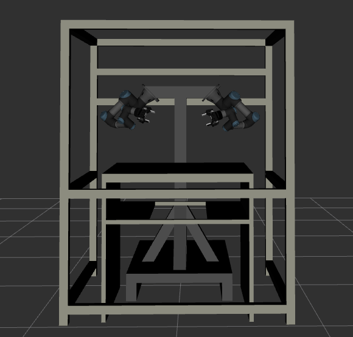

# dual-arm-workcell (with no grippers)

I built this catkin workspace for simulating the dual-arm workcell I have been using for my robotic manipulation research. The workcell constitutes two UR3 robot arms equipped with 2F-85 robotiq grippers. The grippers have camera mounted on them manually. I carried out the intrinsic and extrinsic calibrations [here](https://github.com/Robotawi/hand-eye-calibration). The workcell has a cage with multiple cameras, mainly to provide visual and point cloud data.

## The simulated workcell/robot
The workcell simulation after building its xacro including workscell structure, robots, and grippers.



Here is a closed look on the dual-arm robot


## Purpose:
This project is for porting my research studies to be done using ROS and MoveIt. It will also serve as my virtual lab for single arm and dual-arm manipulation planning. **This branch details how to create a MoveIt config package and a Gazebo world for execution with all the required controllers.**

## Steps:

In the following steps, we ought to differentiate between `robot_name` package and `robot_name_moveit_config`. The first is the one that contains the `xacro` file of the robot, and the second in the one created using MoveIt setup assistant. 

1. Create a `robot_name_moveit_config` package using MoveIt setup assistant, using the robot URDF in the `robot_name` package.
2. In the `robot_name` package, config directory, write two controllers `robot_name_gazebo_control.yaml` and `trajectory_control.yaml`. Both are for ros-control, the first is to configure the position controllers for every joint. The second is for the trajectory control. 
The content of the `robot_name_gazebo_control.yaml` is as follows
```
dual_arm:
  # Publish all joint states
  joint_state_controller:
    type: joint_state_controller/JointStateController
    publish_rate: 50  
  
  # Position Controllers
  rgt_joint1_position_controller:
    type: position_controllers/JointPositionController
    joint: rgt_shoulder_pan_joint
  rgt_joint2_position_controller:
    type: position_controllers/JointPositionController
    joint: rgt_shoulder_lift_joint
  rgt_joint3_position_controller:
    type: position_controllers/JointPositionController
    joint: rgt_elbow_joint
  rgt_joint4_position_controller:
    type: position_controllers/JointPositionController
    joint: rgt_wrist_1_joint
  rgt_joint5_position_controller:
    type: position_controllers/JointPositionController
    joint: rgt_wrist_2_joint
  rgt_joint6_position_controller:
    type: position_controllers/JointPositionController
    joint: rgt_wrist_3_joint
  lft_joint1_position_controller:
    type: position_controllers/JointPositionController
    joint: lft_shoulder_pan_joint
  lft_joint2_position_controller:
    type: position_controllers/JointPositionController
    joint: lft_shoulder_lift_joint
  lft_joint3_position_controller:
    type: position_controllers/JointPositionController
    joint: lft_elbow_joint
  lft_joint4_position_controller:
    type: position_controllers/JointPositionController
    joint: lft_wrist_1_joint
  lft_joint5_position_controller:
    type: position_controllers/JointPositionController
    joint: lft_wrist_2_joint
  lft_joint6_position_controller:
    type: position_controllers/JointPositionController
    joint: lft_wrist_3_joint
```


The content of the  `trajectory_control.yaml` is as follows
```
dual_arm:
  rgt_arm_joint_controller:
    type: "position_controllers/JointTrajectoryController"
    joints:
      - rgt_shoulder_pan_joint
      - rgt_shoulder_lift_joint
      - rgt_elbow_joint
      - rgt_wrist_1_joint
      - rgt_wrist_2_joint
      - rgt_wrist_3_joint
    constraints:
        goal_time: 0.6
        stopped_velocity_tolerance: 0.05
        rgt_shoulder_pan_joint: {trajectory: 0.1, goal: 0.1}
        rgt_shoulder_lift_joint: {trajectory: 0.1, goal: 0.1}
        rgt_elbow_joint: {trajectory: 0.1, goal: 0.1}
        rgt_wrist_1_joint: {trajectory: 0.1, goal: 0.1}
        rgt_wrist_2_joint: {trajectory: 0.1, goal: 0.1}
        rgt_wrist_3_joint: {trajectory: 0.1, goal: 0.1}
    stop_trajectory_duration: 0.5
    state_publish_rate:  25
    action_monitor_rate: 10

  lft_arm_joint_controller:
    type: "position_controllers/JointTrajectoryController"
    joints:
      - lft_shoulder_pan_joint
      - lft_shoulder_lift_joint
      - lft_elbow_joint
      - lft_wrist_1_joint
      - lft_wrist_2_joint
      - lft_wrist_3_joint
    constraints:
        goal_time: 0.6
        stopped_velocity_tolerance: 0.05
        lft_shoulder_pan_joint: {trajectory: 0.1, goal: 0.1}
        lft_shoulder_lift_joint: {trajectory: 0.1, goal: 0.1}
        lft_elbow_joint: {trajectory: 0.1, goal: 0.1}
        lft_wrist_1_joint: {trajectory: 0.1, goal: 0.1}
        lft_wrist_2_joint: {trajectory: 0.1, goal: 0.1}
        lft_wrist_3_joint: {trajectory: 0.1, goal: 0.1}
    stop_trajectory_duration: 0.5
    state_publish_rate:  25
    action_monitor_rate: 10
```

Notes:
- The two move groups require two controllers. Otherwise, we encounter the error `Joints on incoming goal don't match the controller joints.` 
- The constraint `goal_time: 0.6` eliminates the warning `[ WARN]: Controller dual_arm/lft_arm_joint_controller failed with error GOAL_TOLERANCE_VIOLATED: 
[ WARN]: Controller handle dual_arm/lft_arm_joint_controller reports status ABORTED`. 


3. Create two launch files to load the previous two control configurations. Let the names be descriptive such as `robot_name_gazebo_controller.launch` and `robot_name_trajectory_controller.launch`. 

**Inside the `robot_name_moveit_config` package, we need to make five changes.**

4. Create a `controller.yaml` file inside the config directory. The controllers names must be the same as the above `trajectory_control.yaml` Its contents are as follows.
    
```
controller_manager_ns: controller_manager
controller_list:
  - name: dual_arm/rgt_arm_joint_controller
    action_ns: follow_joint_trajectory
    type: FollowJointTrajectory
    default: true
    joints:
      - rgt_shoulder_pan_joint
      - rgt_shoulder_lift_joint
      - rgt_elbow_joint
      - rgt_wrist_1_joint
      - rgt_wrist_2_joint
      - rgt_wrist_3_joint

  - name: dual_arm/lft_arm_joint_controller
    action_ns: follow_joint_trajectory
    type: FollowJointTrajectory
    default: true
    joints:
      - lft_shoulder_pan_joint
      - lft_shoulder_lift_joint
      - lft_elbow_joint
      - lft_wrist_1_joint
      - lft_wrist_2_joint
      - lft_wrist_3_joint
    
```
5. Create a launch file `moveit_planning_execution.launch` inside the config package launch directory. 
```
<launch>
    # The planning and execution components of MoveIt! configured to 
    # publish the current configuration of the robot (simulated or real)
    # and the current state of the world as seen by the planner
    <include file="$(find mylabworkcell_moveit_config)/launch/move_group.launch">
        <arg name="publish_monitored_planning_scene" value="true" />
    </include>
    # The visualization component of MoveIt!
    <include file="$(find mylabworkcell_moveit_config)/launch/moveit_rviz.launch" />
</launch>
```

6. Edit the two files `myworkcell_moveit_controller_manager.launch` and `myworkcell_moveit_controller_manager.launch.xml` to load the `controllers.yaml` file instead of the default `ros_controllers.yaml` file. 

7. In the `trajectory_execution.launch.xml`, comment the line 21 `<arg name="execution_type" value="$(arg execution_type)" />` as it causes an error of an unneeded argument. 

8. In the `robot_name` package, add the launch file `robot_name_bringup_moveit.launch` file. The file loads the robot in a gazebo world, loads the two gazebo controllers, moveit_planning_execution launch file, and the robot state publisher. It should be as follows.
```
<launch>
  <!-- Launch Gazebo  -->
  <include file="$(find mylabworkcell_support)/launch/view_dual_arm_gazebo_empty_world.launch" />   

  <!-- ros_control seven dof arm launch file -->
  <include file="$(find mylabworkcell_support)/launch/dual_arm_gazebo_controller.launch" />   

  <!-- ros_control trajectory control dof arm launch file -->
  <include file="$(find mylabworkcell_support)/launch/dual_arm_trajectory_controller.launch" />    

  <!-- moveit launch file -->
  <include file="$(find mylabworkcell_moveit_config)/launch/moveit_planning_execution.launch" />    

	<!-- publish joint states -->
	<node name="joint_state_publisher" pkg="joint_state_publisher" type="joint_state_publisher">
		<param name="/use_gui" value="false"/>
		<rosparam param="/source_list">[/move_group/fake_controller_joint_states]</rosparam>
	</node>
</launch>
```

9. In the `robot_name` package, robot model `xacro` file, make sure to include the gazebo ros control plugin with the correct namespace as follows. If not included, the controllers are not loaded. 
```
    <gazebo>
        <plugin name="gazebo_ros_control" filename="libgazebo_ros_control.so">
            <robotNamespace>/dual_arm</robotNamespace>
        </plugin>
    </gazebo>

```
## References:
I found the ROS package for UR robots in the project of [O2AC](https://github.com/o2ac/o2ac-ur) truly beneficial to adjust the controllers constraints. Thanks to [Felix von Drigalski](https://github.com/felixvd) for open-sourcing it. 

## Contact:
In this project, I built everything from scratch because I love to understand how the internals of ROS work. This is a step towards my aim to actively contribute to robotics open-source software.

If you are interested in the presented work/ideas or if you have any questions, please feel free to connect with me on [LinkedIn](https://www.linkedin.com/in/mohraess). We can discuss about this project and other interesting projects.

